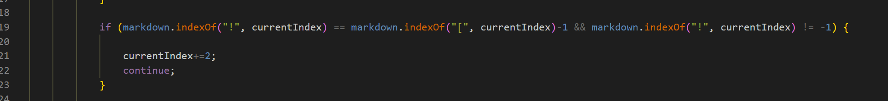

# Ali's CSE 15L Lab Report
## Debugging

### **Motivation**
This Blog Post is served to deal with debugging through high volumes of tests. This Blog Post will revolve around testing two MarkdownParser files of different implementations:

(1) [Our group's MDParser](https://github.com/21KennethTran/markdown-parser.git)  
(2) [Lab 9 implementation](https://github.com/nidhidhamnani/markdown-parser.git)  

--- 
### **Identifiying Potential Bugs**
* Both Implementations ran through 652 test cases using a `bash script` designed to continously run through all test cases and eventually output them in a text file  ` bash script.sh > results.txt `. The two implemmentations later went through comparisons through `vimdiff`  
* Notable differences were found in Tests _473_ and _516_

### **Diagnosing the Diffrences _(& therefore Potential Bugs)_**

#### **Test 473**
  
 _Note: Left side is our implementationa and right side is the Lab9 implementaion_  
 * In this case, the Lab9 implementation is correct as it correctly captured what was expcted from it  (as shown in the preview below):  
   
 * A possible bug could be the resukt of the implementaion of `https:` as a condition for the link to be obtained ignoring correct links that do not have such. Such a bug can be fixed by **removing** the lines of code involving it( lines are shown below ):  
 
  
#### **Test 516**
  
* In this case, it is our implementations that provides the correct output as it does not taki in the image as a link as done by the Lab9 implementation (preview shown below)    

* A possible bug could be the lack of consideration for the syntax of a hyperlinkk carrying an image rather than a website link; this can be distinguished through by `!`. Therefore a possible fix could involve checking for the presence of `!` before a `[` such that its absence signifies that it is not an image ( lines are shown below ):  

--- 
### **Wrap up**
This is the end of the blog post; I hope you foundit useful. **Happy Coding!**